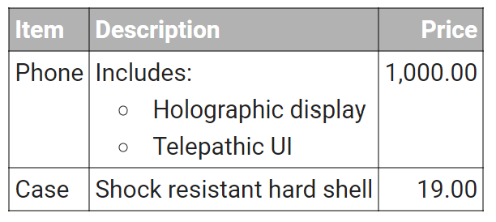

# 汉王N10摘抄笔记处理

## 汉王N10笔记功能的特色

当使用汉王N10读书的时候，我们的笔记被分成了三部分：

1. 摘抄文件，这里面有原始的摘抄，也有打开摘抄文件后自已写的想法等
2. 截图，截图有三个来源：
    1. 屏幕截图
    2. 阅读pdf时，使用“提取”中的“区域截图”生成的图片文件
    3. 手写笔记导出为图片
3. 手写笔记OCR识别为文本，你可能不喜欢打开摘抄文件写字，更喜欢手写想法

汉王N10摘抄很有特点：

* 汉王N10可以**随时随地**地打开摘抄文件进行编辑，在里面加入自已的**想法**，或进行**初步整理**
* 其他家的阅读器都是: 1)先“标注+高亮”，2)然后导出标注到文件

很明显，汉王N10的摘抄更加的自由，缺点就是不像其他家那样在原件中留下痕迹，比如高亮文本，标注泡泡等

但如果你像我一样不喜欢在书上写写画画，那么这个缺点也就不是缺点了，书上写写画画的东西只有再次看书的时候才能看到，不是有效的读书形式。最重要的依然是导出的摘抄文件。

汉王N10也能手写笔记，但因为摘抄功能实在太好用了，读书时基本用不到手写笔记

## 汉王N10笔记功能的痛点

### 痛点1：摘抄内容越积越多时，打开摘抄文件，没有自动定位到文件最后，不方便编辑

这个痛点可以通过安装百度输入法或是搜狗输入法解决，建议使用百度输入法，搜狗输入法有点小小的不方便

安装百度输入法后，你会在键盘上方的工具栏里看到一个`<I>`这样的工具按钮，点进去，里面有跳到文件开始和结尾的按钮

### 痛点2：摘抄出来的文本乱糟糟的

N10的一次“摘抄”得到的内容是下面这样的  （注：其中的"**"是我加的markdown标志)

```txt
2022年09月05日 22:15:31  摘自<<心理学与生活 - 19th - 理查德·格里格-人民邮电出版社 (2014).pdf>> 第42页
当**铁钦纳**把冯特的心理学带回美国时,他提倡用 
这种科学方法来研究意识。他用于检查意识的心理活 
动元素的方法是**内省法(introspection)**,即由个体系 
统地检查自己有关特定感官经验的思维和感受 铁钦 
纳强调**“什么”是心理的内容**，而非“为什么”和“怎 
么”思考。他的观点以**结构主义(structuralism)**之名 
著称于世.即对心理和行为的结构的研究：
```

这一段内容以下问题：

1. 那一段带有年月日时间的“抬头行”对笔记的完整性来说是非常有必要的的，里面记录了详细的“上下文”信息。但在整理完后的笔记里“抬头行”肯定是要删掉的
2. 文本换行的问题： 这是所有pdf摘抄都存在的问题，不光是汉王N10

在摘抄英文的时候，可能还会出现别的问题：

```txt
2022年09月11日 15:10:16  摘自<<Introduction to Psychology_ Gateways to Mind and Behavior - 13th - Dennis Coon, John O. Mitterer-Wadsworth Cengage Learning (2012).pdf>> 第63页
The biological perspective    seeks to explain our behavior in terms 
of  biological    principles    such  as  brain  processes,  evolution,and 
genetics.
```

不知道什么原因，

1. 单词之间有很多多余的空格
2. 有时候英文标点后面没有空格，导致单词粘在一起

### 痛点3：摘抄、截图、手写笔记OCR文本，这三种类型的笔记如何整合在一起

这三种形式的笔记虽然看上去是分开的，但有一条“时间线”将他们联系到了一起

* 摘抄的“抬头行”里有时间信息
* 截图文件有“文件创建时间”
* 手写笔记OCR文本里没有时间信息，但我们可以手写简单的时间信息来辅助整合

## 解决问题的小脚本

脚本放在github上，可以从下面的位置获取，

<https://github.com/lutts/n10_note_utils>

* 如果你是程序员，安装了git，直接git clone即可
* 如果你不是程序员，可以下载zip打包文件

运行脚本所需要的环境：python 3

### python

如果你不是程序员，建议从Microsoft Store安装，安装完后就可以用了，不需要其他手工设置，方法如下

1. 打开Microsoft Store
2. 搜索`python`
3. 安装最新的版本，写这篇文章时是3.10，如下图所示，注意不要安装带(RC)字样的版本


安装完python后，还要安装程序依赖的一些程序包，

打开windows命令行或是PowerShell，依次执行以下命令：

1. `pip install pyperclip`
2. `pip install markdown-it-py[plugins]`
3. `pip install css_inline`
4. `pip install regex`
5. `pip install pywin32`
6. `pip install pathlib2`
7. `pip install pillow`

或者使用`pip install -r requirements.txt`来安装所有的依赖

这时候就可以从运行我的脚本了，但每次都要打开命令行，很不友好，因此建议再安装AutoHotKey

### AutoHotKey

AutoHotKey的作用就是你可以定制一个快捷键来执行一些脚本，省得每次都要打开命令行

AutoHotKey可以从它官网下载：<https://www.autohotkey.com/>

我的脚本ahk目录下有个MyHotScripts.ahk，不过你暂时不能直接运行，需要稍加修改

打开MyHotScripts.ahk，在第11行找到以下内容:

```txt
PYTHON_UTILS_DIR := "D:\Data\python\projects\my_utils\"
```

将其中的路径改为我的脚本的目录路径。

如果需要在系统开机的时候自动启动，将MyHotScripts.ahk复制或者链接到以下目录：

```txt
C:\Users\<你的用户名>\AppData\Roaming\Microsoft\Windows\Start Menu\Programs\Startup
```

我的AHK文件的快捷键配置如下：

* Caps Lock + p: 运行笔记处理程序

会弹出一个文件选择框，选择你的摘抄文件，如果有手写笔记的导出文本文件，也一并选上

**注： 图片文件不需要选，会自动扫描摘抄文件所在文件夹里的png图片文件**

### 程序的功能

程序运行完成后，会生成markdown和html两种格式的文本，并且会同时**放入剪贴板**以及**生成两个磁盘文件**：

* XXX.md: 其中XXX是你的摘抄文件名，这个md文件是markdown格式的处理后的文件
* XXX.html: 这是渲染出的网页文件
  
如果你喜欢markdown，可以打开md文件进行编辑。

如果你想导入到笔记软件或word中，并且保留加粗/斜体/列表等格式，你可以直接打开笔记软件，粘贴即可，因为程序自动将html和markdown放到剪贴板了

痛点中提到的两段摘抄处理结果如下:

```txt
(p42) 当**铁钦纳**把冯特的心理学带回美国时, 他提倡用这种科学方法来研究意识。他用于检查意识的心理活动元素的方法是**内省法**(**introspection**), 即由个体系统地检查自己有关特定感官经验的思维和感受 铁钦纳强调**“什么”是心理的内容**，而非“为什么”和“怎么”思考。他的观点以**结构主义**(**structuralism**)之名著称于世. 即对心理和行为的结构的研究：

(p63) The biological perspective seeks to explain our behavior in terms of biological principles such as brain processes, evolution, and genetics.
```

可以看到，程序做了以下处理

* 去掉了“抬头行”，只保留了“(p42)”这样简单的上下文提示，相对那一个长长的抬头行来说，文本不再那么混乱，而且你也能很方便地删掉这些页码信息
* 去掉了多余的换行
* 去掉了多余的空格
* 如果英文标点后面没有空格，会自动加一个空格
* 对markdown进行了commonmark规范化处理(免得初学markdown的把一些语法写错)

除了上面看到的处理之外，程序还有以下功能

* 会将截图根据图片创建时间插入到合适的位置
* 会将手写笔记导出文本根据手写的时间插入到合适的位置，后面有关于手写笔记时间格式说明
* 程序会保留空行，但多个连续的空行只会保留一下
* 程序去掉多余的换行是非常智能的，如果你在记笔记的时候就使用markdown进行了初步处理，你会发现程序会保留你做的这些处理
  * 例如：你摘抄了一首诗，诗里的换行符肯定是不能去掉的，此时你就可以用fenced code block来把这段摘抄保护起来了

程序还支持按页排序、插入、替换操作，在下一节详细讲。

为什么搞这么复杂？ 轻度读者可能无所谓，但大量记笔记的人很快就会感到在电纸书的记笔记的不方便：因为墨水屏的刷新率太慢，打字都是龟速，各种文本操作都很不方便。在这种情况下，将笔记导出到电脑上处理是唯一的选择。但从记笔记到导出笔记进行处理，中间会隔一段时间，因此有些操作必须要在记笔记的同时及时的完成。这就产生了一个矛盾：在电纸书上操作不方便，但又必须要操作。 为此，我这个程序的另一个目的就是尽量提供相关的功能来减轻在电纸书上的操作负担。

### 笔记顺序调整

支持以下功能:

* 按页码排序
* 插入和替换
* 内容跟随
* 内容固定

下面是相关功能的详细说明

#### 按页码排序

程序还支持根据页码排序的功能，适用于以下场景：

> 当你读完第9页，接着读了第10页，然后发现第9页有些地方遗漏了，就又回到第9页，摘抄了一些文本

#### 插入和替换

程序还支持自定义插入和替换功能，适用于以下场景：

> 当简单的页码排序不满足你的要求时，比如你想将后摘抄的内容插入前面摘抄内容的某个位置，或者完全替换掉某个摘抄

**插入**功能使用方法如下

* 如果想把某一次摘抄插入到别的位置，则在这个摘抄的抬头行后第一行添加一个`[placeholder]:.`标志，其中的placeholder名字可以任意取
* 在`插入点`添加`[placeholder]`

下面的例子中，c和d会插入到a的的后面

```text
2022年10月04日 09:58:38  摘自<<Psychology and Life 20th.pdf>> 第176页
aaaaaaaaaa
[placeholder]

2022年10月04日 10:01:12  摘自<<Psychology and Life 20th.pdf>> 第176页
bbbbbbbbbb

......
......

2022年10月04日 13:00:27  摘自<<Psychology and Life 20th.pdf>> 第178页
[placeholder]:.
ccccccccc

ddddddddd
```

替换功能使用方法如下

* 如果想把某一次摘抄替换到别的位置，则在这个摘抄的抬头行后第一行添加一个`[placeholder]:.`标志，其中的placeholder名字可以任意取
* 在需要被替换掉的摘抄的抬头行后第一行添加`[placeholder]:-`

下面的例子中，a和b的内容会完全替换掉x和y的内容

```text
2022年10月04日 09:58:38  摘自<<Psychology and Life 20th.pdf>> 第176页
[placeholder]:-
xxxxxx

yyyyyy

2022年10月04日 10:01:12  摘自<<Psychology and Life 20th.pdf>> 第176页
zzzzzz

......
......

2022年10月04日 13:00:27  摘自<<Psychology and Life 20th.pdf>> 第178页
[placeholder]:.
aaaaaaa

bbbbbbb
```

#### 内容跟随

使用场景：某个摘抄始终跟随前一个摘抄，哪怕是前一个摘抄因为排序或是插入、替换而变换了位置，也会跟着它到新的位置

这种情况一般发生在以下操作顺序中:

1. 从当前页摘抄一些内容
2. 使用`页面跳转`跳转到别的页，摘抄一些和当前页高度相关的一些内容

在这个操作顺序中，两次摘抄的内容高度相关，他们是一体的

这个功能相当于删除了第二个摘抄的抬头行，但是在电纸书上，因为没有鼠标之类的，加上刷新率又慢，删除一个抬头行还是很费劲的

使用方法: 在抬头行后的第一行添加一个`[]:+`，表示和前一个摘抄是一体的

示例:

```text
2022年10月04日 13:00:27  摘自<<Psychology and Life 20th.pdf>> 第178页
aaaaaaaa

2022年10月04日 13:00:27  摘自<<Psychology and Life 20th.pdf>> 第518页
[]:+
bbbbbbbb
```

实际效果就相当于删除了“第518页”这个抬头行

#### 内容固定

使用场景: 不希望某次摘抄的内容受页面排序的影响

使用方法：在抬头行后的第一行添加一个`[]:.`，表示这个摘抄不参与页面排序

示例:

```text
2022年10月04日 13:00:27  摘自<<Psychology and Life 20th.pdf>> 第178页
aaaaa

2022年10月04日 13:00:27  摘自<<Psychology and Life 20th.pdf>> 第179页
bbbbb

2022年10月04日 13:00:27  摘自<<Psychology and Life 20th.pdf>> 第178页
[]:.
ccccc
```

如果不加特殊标志，c会因为页面排序而调整到a的后面

### 手写笔记手写时间格式

手写时间戳的时候，经过识别出来的格式要是下面这个样子的

```txt
2022.9.14-13:56
```

* 年：4位数字
* 月：1~2位数字
* 日：1~2位数字

年月日用英文点(.)分隔

* 时：1~2位数字，要使用24小时制
* 分：1~2位数字
  
时分用英文冒号(:)分隔

年月日 和 时分 之间用短横(-)分隔

## 关于markdown

Q: 为什么用markdown?

A: 因为我同时使用Onenote, Visual Studio Code, theBrain, supermemo这四个软件进行笔记整理，这四个软件所要求的格式各不相同，因此需要一个中间格式，markdown是最好的选择，markdown能很方便地转换为其他格式

markdown语法简单，使得你可以在阅读器上就预先对笔记进行简单的处理，用于突出一些重点等。因为汉王N10能直接编辑摘抄文件，加上markdown可以使得你记笔记的效果更加好

我的程序使用了符合Commonmark的markdown标准，下面的链接里有简单的介绍

<https://commonmark.org/help/>

此外还支持以下扩展：

* github风格的markdown表格
  * 表格单元中支持多行文本，语法在后面说明
* katex数学公式

下面是一些markdown示例

```txt
**加粗**

*斜体*

列表:

* item 1
* item 2
* item 3
```

效果如下

**加粗**

*斜体*

列表:

* item 1
* item 2
* item 3

### 表格单元多行文本支持

示例：

```markdown
| Item | Description | Price|
|--- | --- | ---: |
| Phone | Includes:{nl}* Holographic display{nl}* Telepathic UI|1,000.00|
| Case| Shock resistant hard shell|19.00|
```

渲染结果如下



语法很简单： 虽然table单元格只能有一行文本，但可以使用`{nl}`来表示换行，如上面的例子，写成多行是下面这样的：

```markdown
Includes:
* Holographic display
* Telepathic UI
```

你只需要把你的多行markdown中的换行替换成`{nl}`就行了

这个语法和theBrain的语法是一致的，方便你将markdown表格拷贝到theBrain中

## 如果你直接使用markdown进行编辑

程序生成markdown文件后，你可以使用你喜欢的编辑器进行编辑，推荐使用**Visual Studio Code**，这虽然是给程序员用的编辑器，但对普通人来说也是可以用的，特别是对markdown的支持非常完善

如果你直接编辑markdown文件，而不是第一时间将笔记导入到Onenote或印象笔记等软件中，那么我这里还为你提供了一些方便的markdown转html的工具，方便你在处理完markdown后将最终结果导入到其他软件中，比如辅助记忆软件supermemo

* **Caps Lock + o**: 将md文件渲染成html，放入剪贴板。会弹出一个文件选择框，选择需要处理的md文件即可。
  * 如果你是导入到onenote，并且你的markdown中有本地图片，onenote是无法获取到这些图片的，因此程序会自动开启一个http服务器，方便onenote获取markdown中的图片。完事后，记得将http服务器的命行窗口手动关闭
* **Caps Lock + m**: 将剪贴板里的markdown渲染成html，并重新放入剪贴板

## 数学公式支持

如果需要Latex数学公式支持，你还需要安装Node.js, npm和Katex，方法如下:

* 到Node.js官网<https://nodejs.org/en/download/>下载最新的node.js安装包
* Node.js的安装包也会安装npm，因此不需要单独安装npm
* 安装完Node.js后，执行`npm install -g katex`安装katex

对于Latex数学公式支持不怎么好的应用，比如OneNote，你可以选择在将markdown导入onenote时，将latex公式替换为图片

程序本身不支持直接将latex公式转换为图片，因为太麻烦了，要支持好基本都需要安装Latex，这可是好几个GB的安装呀，划不来。

程序采用的方案是分三步走：

1. **Caps Lock + l**: 从md文件中将latex公式提取出来，并生成一个hash码，所有的公式放入一个latex_equations.txt文件中，并且是将inline和block的公式分开存放的，这是因为OneNote不支持在文字间inline图片，因此对于inline的latex公式，不能替换为图片。因为inline的公式一般都很简单，OneNote本身的Latex公式渲染器一般都能搞定
   * 同一个公式如果同时出现在Inline和block中，得到的hash码是不一样的，因此你不用担心会弄混
2. 第二步，打开生成的latex_equations.txt文件，到一些在线的latex公式编辑器里转换化图片，比如[Apose](https://products.aspose.app/tex/equation-editor/png)。保存图片的时候，使用第一步生成的hash码作为文件名
3. 第三步，**Caps Lock + o**选择md文件，此时就会将latex公式替换为图片了

对于supermemo, theBrain等支持图片和文字内联(inline)的，还提供了另一个入口

* **Caps Lock + u**: 发送到supermemo，inline和block的公式都会使用你准备好的图片替代，并且还会针对supermemo分辨率的问题调整图片的大小

## 关于supermemo

supermemo对内联图片的支持乱七八糟，因此在将markdown转为supermemo适用的格式的时候，可以指定一个特定的目录webroot，统一将图片放到这个目录下，这样可以避免supermemo的很多图片问题

要支持这个功能，需要在脚本所在的src目录下放置一个配置文件: settings.json，内容如下，其中的目录可以根据你的需要进行设置：

```json
{
	"webroot" : "D:\\Data\\supermemo\\collections\\webroot"
}
````

有了这个目录后，网页中的本地图片都会**拷贝**到这个目录里，放在一个唯一的UUID目录下，生成的HTML中的图片路径都会指向这个路径，暂时不支持从internet上直接下载图片。

要注意的是，生成的HTML中的路径是诸如`http://localhost:9999:/xxx.png`这样的形式的，并不是写死的windows路径，因此都开启supermemo的时候也需要同时开启一个http server，虽然有点不方便，但通过AHK可以同时启动这supermemo和http server，所以问题不大:

* Caps Lock + s: 启动supermemo，然后再启动一个以指定的webroot目录为根目录的python http server

因为脚本中的可执行文件路径是写死的，因此你如果也使用supermemo，需要修改MyHotScripts.ahk中的RunSupermemo实现，将里面的路径改为你的路径
