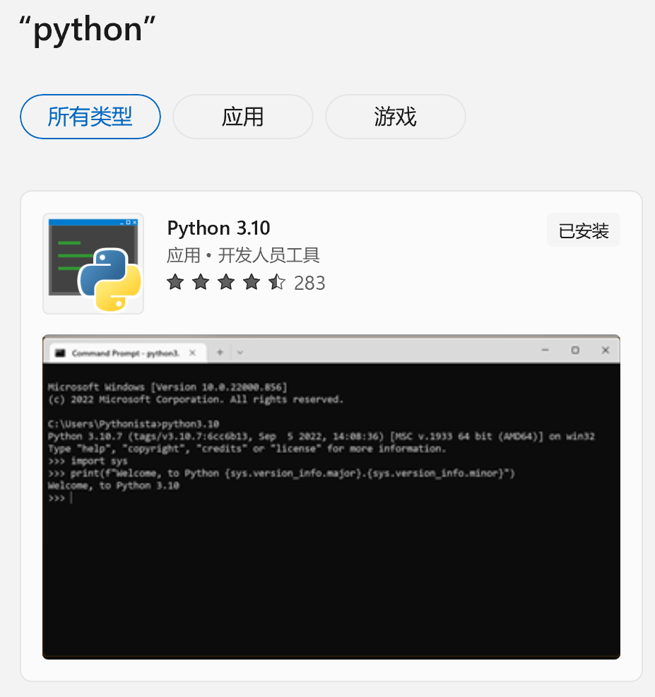

# 读书笔记处理程序

## 目标

* **电纸书辅助功能**
  * 电纸书操作不便，程序会尽量提供相关的功能来减轻在电纸书上的操作负担
  * 使导出的笔记更容易阅读
  * 通过一些自定义的特殊标志，允许读者对笔记有更灵活的内容管理，
* **电脑端的读书笔记辅助功能**
  * 实现了一个**为阅读定制的剪贴板管理器**，收集阅读过程中 Ctrl+C 拷贝的文本，并自动收集文件名、页码等信息，存放到一个文本文件中
  * **文本规范化**：主要体现在 Capslock+v 快捷键，这个类似于 Ctrl+v, 但是会对剪贴板中的内容进行中文、英文、markdown 规范化后再粘贴
* 一些方便和诸如 **theBrain, supermemo, Cornell note-taking** 等学习辅助软件/系统交互的快捷功能

## 现有笔记功能的问题

1. 摘抄出来的文本乱糟糟的
   * 一段话被分成了多行
   * 中文之间或英文单词之间有多余的空格
   * 标点使用不规范
2. 截图和文本是分开的
3. 摘抄的顺序问题
   * 一般有两种排序：
     1. 按摘抄在书中的出现顺序排序
     2. 按摘抄的时间顺序排序
   * 这两种排序都有不尽如人意的地方：
     * 按出现顺序排序的问题：有时我们希望将相关的内容摘抄在一起，按出现顺序排序无法做到这点
     * 按时间顺序排序的问题：如果我们在第 N 页摘抄了一些文本，然后读到了 N+3 页，突然想到第 N 页有漏掉的，就返回到第 N 页。这种情况下，按时间排序会打乱我们的想法
     * 有时，我们希望把相关的内容聚合在一起，而不是简单的按页或按时间排序

## 各电纸书笔记功能的问题与特色

### 问题

墨水屏的**刷新率太慢**，从而导致很多操作非常不方便

* 打字不方便，一分钟打不了几个字
* 文本编辑不方便：操作起来太慢了

因此，将笔记导出到电脑上处理是唯一的选择，但这会引发其他一些问题：

* 即时性问题：想法稍纵即逝，有些操作必须要在记笔记的同时及时的完成，导出到电脑之后再处理，可能就想不起来了

### 特色

一般来说，各电纸书的笔记有以下来源：

1. 摘抄文件或是笔记导出文件，这里面有原始的摘抄，也有打开摘抄文件后自已写的想法等
2. 截图，截图来源：
    1. 屏幕截图
    2. 手写笔记导出为图片
3. 手写笔记 OCR 识别为文本

各家电纸书又稍有不同，各有优缺点：

* 直接摘抄类，选中的文本可以直接摘抄到文本文件，不需要事后导出。典型的是汉王 N10
  * 如果要写自已的想法，需要从菜单中打开摘抄文件进行编辑
  * 优点：能随时修改笔记**原文**，这就给了我们使用 **markdown** 语法来标记一些重点词、保留原文中的列表之类的格式化文本
  * 缺点：随着笔记文件内容越来越多，如果**过了一段时间后**想针对某个摘抄写自已的想法，很难定位到相应的原文
    * **即时**想法不受影响，即时想法能立即打开摘抄文件写下来
    * **非即时**想法可以通过按页排序来减小影响
* 笔记导出类，这类一般是读书时做标志，如高亮、下划线、标注等，读完书后需要手工做导出操作：
  * 优点：在原文上做标注更精准，笔记再多也不影响
  * 缺点：原文却无法修改，有些事是标注做不到的，比如标志一些重点词、保留原文中的列表之类格式化文本

对于有**大量笔记需求**的人，个人认为能**修改原文是硬性要求**！在书本上记笔记时，我们会使用一些特殊的标志，例如：圆圈、方框、单下划线、双下划线、序号、星号…

这些标志可能只标志一个单词、一个短语，对于那些 `事后笔记导出类` 的电纸书，你不可能将笔记做得很精细，否则的话导出的就是一大堆小碎片了！

所以，对于有大量笔记需求的人，例如学生，个人强烈推荐汉王 N10, **能随时修改摘抄原文，配合 markdown, 能将笔记做得很精细**

### 汉王 N10 笔记功能的问题

摘抄内容越积越多时，打开摘抄文件，没有自动定位到文件最后，不方便编辑

这个问题可以通过安装百度输入法或是搜狗输入法解决

以百度输入法为例，在键盘上方的工具栏里看到一个 `<I>` 这样的工具按钮，点进去，里面有跳到文件开始和结尾的按钮

## 我的读书笔记处理程序

程序的目的就是尽量提供相关的功能来减轻在电纸书上的操作负担

### 程序的功能

* 解析电纸书的摘抄文件或者是笔记导出文件
  * 目前只支持汉王 N10, 因为我没有别的电纸书
* 多行文本智能合并：能识别 markdown, 依据 commonmark markdown 语法进行智能多行合并
* 文本规范化：智能处理空格、标点等，markdown 规范
* 合并图片和文本：按时间顺序，将图片插入到 markdown 文件的特定位置
* 手写 OCR 文本合并：也是按时间顺序，这需要在手写笔记时手工写上时间标志
* 更自由的笔记排序：
  * 智能排序：
    * 按时间排序+按页排序：在按时间排序的基础上，将相同页码的笔记聚合到一起，从而允许在读到第 N+n 页后，返回第 N 页摘抄漏掉的笔记
    * 内容跟随 (`[]:+`): 方便将相关的内容聚合在一起，不受时间、页码的影响
    * 内容固定 (`[]:.`): 在按时间排序的基础上，允许某些内容不受按页排序的影响
  * 插入和替换：手工指定特定文本的位置，之所以有这个功能，是因为在电纸书上拷贝粘帖、删除**大量**文本太麻烦了
    * 插入：将某个摘抄插入到其他的任意位置
    * 替换：使用一个新的摘抄替换掉某个不想要的摘抄
* 删除某个摘抄 (`[]:-`)
* 删除摘抄中的某些文本：使用 language 为 `delete` 的 fenced block
* PC 端为阅读定制的剪贴板管理器
  * 支持多来源混合笔记：从多个文件，甚至是从网页摘抄笔记
* Cornell 笔记辅助功能
* 其他辅助功能

上面这些功能有些涉及到一些特殊的标志，你可以借助输入法的短语功能来辅助使用这些标志

后面会对一些功能进行详细说明

### 程序快捷键

每次都要到脚本目录下运行脚本有点麻烦，因此我定义了很多快捷键，有两种快捷键实现方式，你可以选择其中一种使用：

1. 纯 python 实现，位于我的脚本的 src 目录下，有两种启动方式：
   1. `notes_ui.pyw`: 启动一个简单的 GUI 窗口，除了快捷键外，一些功能可以通过点击按钮
      1. 缺点：不能放到另一个桌面，一旦执行需要弹出文件选择框的命令，就会切换桌面，有点不便
   2. `keyboard_monitor.py`: 启动一个 windows console, 只支持快捷键，没有按钮
2. AutoHotKey 实现，需要安装 AutoHotKey, 安装方法后面会详说

推荐使用纯 python 实现的快捷键，不需要安装额外的 AutoHotKey, 而且因为是定制实现，比 AutoHotKey 运行更稳定，没有 AutoHotKey 的一些 Bug.

使用纯 python 实现的快捷键，执行会弹出文件选择对话框的命令时，如果当前剪贴板里有文件路径 (比如右键“复制文件地址”)，则会自动定位到相应的文件夹或文件。因此你可以使用右键“复制文件地址”这种方式来避免一层一层地再一次找文件。

我的快捷键都是使用 Caps Lock 实现的，Caps Lock 不常用，正好利用起来，如果你不是程序员，不建议修改快捷键定义。如果你想自定义快捷键，那就需要安装 AutoHotKey 来实现了

我定义的快捷键汇总如下：

* **Capslock + p**: 整理读书笔记
* **Capslock + o**: 转换 markdown 为 onenote 格式
* **Capslock + l**: 列出 markdown 中的 LaTex 公式
* **Capslock + u**: 转换 markdown 为 supermemo html 格式
* **Capslock + q**: 转换 markdown 为 supermemo Q&A 格式
* **Capslock + f**: 转换 markdown 为 supermemo Q&A 格式，并按预先约定好的格式添加发音音频
* **Capslock + r**: 从 markdown 中抽取 Cornell Question 生成 `cue.md`, 为 recite 服务
* **Capslock + n**: 启动 PC 端的剪贴板管理器 notes monitor
* **Capslock + s**: 启动 supermemo 及相关的 http server
* **Capslock + m**: 转换剪贴板中的 markdown 为 html 格式
* **Capslock + c**: 类似于 Ctrl+c, 但拷贝的结果永远是纯文本
* **Capslock + d**: 针对选中的文本查询 GoldenDict 词典，需要将 GoldenDict 的 hotkey 设置为 Ctrl+Alt+Shift+C
* **Capslock + v**: 类似于 Ctrl+v, 对剪贴板里的文本进行中文、英文、markdown 规范化后再粘帖
* **Capslock + b**: 类似于 Ctrl+v, 将剪贴板里的文本转换为 theBrain 的 markdown 格式再粘帖
* **Capslock + w**: 类似于 Ctrl+v，将剪贴板里的 HTML 转换为 commonmark markdown 格式再粘帖
* **Capslock + e**: 即 Ctrl + i, 用于 markdown 将选中文本转为斜体 (Emphasis), 右手握住鼠标时，左手单手 Ctrl+i 太难按了
* **Capslock + h**: 插入当前年月日时间，例如：`2022年12月04日 23:45:55`
* **Capslock + t**: 即 ctrl+shift+f12, 用于将 supermemo 的 html component 转换为 text component
* **Capslock + 1**: Ctrl+c, 但会和 notes_monitor 配合，将拷贝的内容转换成 markdown level 1 header
* **Capslock + 2**: Ctrl+c, 但会和 notes_monitor 配合，将拷贝的内容转换成 markdown level 2 header
* **Capslock + 3**: Ctrl+c, 但会和 notes_monitor 配合，将拷贝的内容转换成 markdown level 3 header
* **Capslock + 4**: Ctrl+c, 但会和 notes_monitor 配合，将拷贝的内容转换成 markdown level 4 header
* **Capslock + 5**: Ctrl+c, 但会和 notes_monitor 配合，将拷贝的内容转换成 markdown level 5 header
* **Capslock + 6**: Ctrl+c, 但会和 notes_monitor 配合，将拷贝的内容转换成 markdown level 6 header

### Capslock + p 和 Capslock + v 特别说明

Capslock+p 是对选中的笔记文件进行处理

Capslock + v 则是对剪贴板中的内容进行同样的处理，例如，如果你从 pdf 中 Ctrl + C 拷贝出以下文本：

```text
这是
一句话，
应该在
一行才对。
```

此时使用 Capslock + v 粘贴得到的结果就是整合的一行了：

```text
这是一句话，应该在一行才对。
```

Capslock + v 拥有笔记整理的所有功能，后面还有智能表格处理的示例

### 解析汉王 N10 的摘抄笔记

快捷键如下：

* Caps Lock + p: 解析汉王 N10 笔记，生成 markdown 和 html

  会弹出一个文件选择框，选择你的摘抄文件，如果有手写笔记的导出文本文件，也一并选上

  **注：图片文件不需要选，会自动扫描摘抄文件所在文件夹里的 png 图片文件**

关于图片文件的时间戳：

* 我试用了很多安卓 ftp 服务器，只有 Amaze File Manager 能保持图片文件的修改时间，并精确到秒，Amaze File Manager 开源、小巧、无广告。其他诸如 ES 浏览器、小米互传等都只能精确到分钟，无法满足我们的排序要求
* Windows 上的 FTP 客户端推荐 WinScp, 不需要任何设置就能正确处理时区并且能保存时间戳，
  * FileZilla: 需要手动设置时区，默认不保存时间戳

程序会生成 markdown 和 html 两种格式的文本，并且会生成 Cornell 笔记方法和 supermemo 的一些相关文件

* `notes.md`: 这个 md 文件是 markdown 格式的处理后的文件
* `summary.md`: Cornell summary
* `qa.md`: supermemo Q&A
* `notes.html`: 这是渲染出的网页文件

如果当前目录下有同名文件，会在文件名后拼上数字序号以示区分

如果你喜欢 markdown, 可以打开 md 文件进行编辑。

程序还会将 markdown 和 html**放入剪贴板**，如果你想导入到笔记软件或 word 中，并且保留加粗/斜体/列表等格式，你可以直接打开笔记软件，粘贴即可

#### 手写笔记手写时间格式

如果要将手写笔记按时间点合并到摘抄笔记中，则需要在手写笔记手工写上时间戳

手写时间戳的时候，经过识别出来的格式要是下面这个样子的

```txt
2022.9.14-13:56
```

* 年：4 位数字
* 月：1~2 位数字
* 日：1~2 位数字

年月日用英文点 (`.`) 分隔

* 时：1~2 位数字，要使用 24 小时制
* 分：1~2 位数字

时分用英文冒号 (`:`) 分隔

年月日和时分之间用短横 (`-`) 分隔

### 智能 markdown 表格处理

除了普通的根据 markdown 智能合并行之外，程序还能智能地处理 github 形式的 markdown 表格，例如：

下面是刚从 pdf 摘抄出来的文本

```text
column
1 column 2 column
3 
col1 row1
text
col2 row1 col3                    row1
col1
row2
text
col2 row2
```

要手工转换为表格的话，正常来讲需要很多手工操作，但在程序的辅助下，你只需要添加如下面这样的**少量**markdown 标志，就能得到一个想要的表格：

```text
| --- | --- | --- |
| column
1 | column 2 | column
3 |
| col1 row1
text
| col2 row1 | col3                    row1
| col1
row2
text
| col2 row2
| |
```

全选上面的文本，然后**ctrl+c**全部拷贝，然后**Capslock + v**, 得到的结果如下：

```text
| column 1 | column 2 | column 3 |
| --- | --- | --- |
| col1 row1 text | col2 row1 | col3 row1 |
| col1 row2 text | col2 row2 |  |
```

渲染出的网页效果如下

| column 1 | column 2 | column 3 |
| --- | --- | --- |
| col1 row1 text | col2 row1 | col3 row1 |
| col1 row2 text | col2 row2 |  |

要想让程序正确处理，你需要进行以下简单的手工操作：

* 在表格的第一行添加形如 `| --- | --- | --- |` 这样的行，这个例子里是三列，你可以根据你的表格的具体列数进行增减，比如，2 列就是 `| --- | --- |`
* 对照 pdf 上的表格，在适当的位置添加 `|` 来分隔各个单元格的内容，如果有空的单元格，记得要多添加一个 `|`, 如上面例子中最后一行的 `| |`

就这么简单！

### 内容跟随

使用 `[]:+` 标志，在 N10 的摘抄文件中，这个标志必须紧跟抬头行单独一行，示例如下

```text
2022年10月04日 12:51:08  摘自<<Psychology and Life 20th.pdf>> 第196页
aaa

2022年10月04日 12:51:08  摘自<<Psychology and Life 20th.pdf>> 第600页
[]:+
bbb
```

有了 `[]:+` 标志，bbb 会一直跟随 aaa, 哪怕是插入或替换，也会一直跟着 aaa

### 内容固定

使用 `[]:.` 标志，在 N10 的摘抄文件中，这个标志必须紧跟抬头行单独一行，示例如下

```text
2022年10月04日 12:51:08  摘自<<Psychology and Life 20th.pdf>> 第196页
aaa

2022年10月04日 12:51:08  摘自<<Psychology and Life 20th.pdf>> 第197页
bbb

2022年10月04日 12:51:08  摘自<<Psychology and Life 20th.pdf>> 第196页
[]:.
ccc
```

如果没有 `[]:.` 标志，ccc 会因为按页排序排到 aaa 后面，有了固定标志后，就不受按页排序的影响了

### 摘抄删除

使用 `[]:-` 标志，在 N10 的摘抄文件中，这个标志必须紧跟抬头行单独一行，示例如下

```text
2022年10月04日 12:51:08  摘自<<Psychology and Life 20th.pdf>> 第196页
aaa

2022年10月04日 12:51:08  摘自<<Psychology and Life 20th.pdf>> 第197页
[]:-
bbb

2022年10月04日 12:51:08  摘自<<Psychology and Life 20th.pdf>> 第196页
ccc
```

上面的 bbb 会被删除，不会出现在最终的 markdown 文件中

### 删除部分文本

使用 language 为 `delete` 的 fenced block, 示例如下：

`````text
aaa

```delete
这些
内容
是要
删除的
```
bbb
`````

### 插入和替换

适用于以下场景：

> 当简单的页码排序不满足你的要求时，比如你想将后摘抄的内容插入前面摘抄内容的某个位置，或者完全替换掉某个摘抄

**插入**功能使用方法如下

* 如果想把某一次摘抄插入到别的位置，则在这个摘抄的抬头行后第一行添加一个 `[placeholder]:.` 标志，其中的 placeholder 名字可以任意取
* 在 `插入点` 添加 `[placeholder]`

下面的例子中，c 和 d 会插入到 a 的的后面

```text
2022年10月04日 09:58:38  摘自<<Psychology and Life 20th.pdf>> 第176页
aaaaaaaaaa
[placeholder]

2022年10月04日 10:01:12  摘自<<Psychology and Life 20th.pdf>> 第176页
bbbbbbbbbb

......
......

2022年10月04日 13:00:27  摘自<<Psychology and Life 20th.pdf>> 第178页
[placeholder]:.
ccccccccc

ddddddddd
```

替换功能使用方法如下

* 如果想把某一次摘抄替换到别的位置，则在这个摘抄的抬头行后第一行添加一个 `[placeholder]:.` 标志，其中的 placeholder 名字可以任意取
* 在需要被替换掉的摘抄的抬头行后第一行添加 `[placeholder]:-`

下面的例子中，a 和 b 的内容会完全替换掉 x 和 y 的内容

```text
2022年10月04日 09:58:38  摘自<<Psychology and Life 20th.pdf>> 第176页
[placeholder]:-
xxxxxx

yyyyyy

2022年10月04日 10:01:12  摘自<<Psychology and Life 20th.pdf>> 第176页
zzzzzz

......
......

2022年10月04日 13:00:27  摘自<<Psychology and Life 20th.pdf>> 第178页
[placeholder]:.
aaaaaaa

bbbbbbb
```

### PC 端为阅读定制的剪贴板管理器

脚本中还有一个 `notes_monitor.py`, 在 PC 端模拟了汉王 N10 的摘抄功能，生成的摘抄文件和汉王 N10 是一致的，可以使用脚本的其他功能解析

因为不能像电纸书那样获取摘抄时的文件名和页码，程序使用了 tesseract 进行 OCR,

使用 pc 端摘抄功能前，需要额外安装 pytesseract,

```bash
pip install pytesseract
```

还需要安装 tesseract windows 版，安装方法还请自行网上搜索

中文识别训练库不是必须的，程序默认从当前窗口的标题文本中搜索文件名，一般都能成功获取，只在获取窗口标题失败时才会进行可能含中文的文件名 OCR 识别

文件名和页码的 OCR 区域需要在 settings. json 中指定

```json
"foxit_filename_region": "34, 0, 2641, 48",
"foxit_page_number_region": "104, 1858, 299, 1896",
"adobe_filename_region": "586, 0, 2641, 48",
"adobe_page_number_region": "782, 183, 1021, 223"
"temp_notes_dir" : "D:\\temp\\notes",
"tesseract_cmd" : "C:\\Program Files\\Tesseract-OCR\\tesseract.exe"
```

region 的指定格式为：left, top, right, bottom

上面还有两个设置项：

* temp_notes_dir: 摘抄和截图保存目录，这个可以不指定，通过快捷键 Capslock + n 打开 notes monitor 时，会弹出选择目录的对话框
* tesseract_cmd: `tesseract.exe` 的位置。如果不指定的话，你需要确保 `tesseract.exe` 在 PATH 环境变量中

脚本会监控剪贴板，因此一般情况下只需要使用 `Ctrl+C` 拷贝，就能自动拼到摘抄文件里

对于剪贴板里的图片文件，会保存为 png 图片文件

辅助的快捷键如下：

* CapsLock & 1:: 将文本拷贝为 markdown level 1 header (#)
* CapsLock & 2:: 将文本拷贝为 markdown level 2 header (##)
* CapsLock & 3:: 将文本拷贝为 markdown level 3 header (###)
* CapsLock & 4:: 将文本拷贝为 markdown level 4 header (####)
* CapsLock & 5:: 将文本拷贝为 markdown level 5 header (#####)
* CapsLock & 6:: 将文本拷贝为 markdown level 6 header (######)
* CapsLock & n:: 启动 notes monitor

从浏览器拷贝时，只支持纯文本，不会保留格式。你可以自行安装 CopyCat (拷贝猫) 这样的浏览器插件来自由选择需要的格式

### 其他辅助功能

* **CapsLock & c**: 将剪贴板中的文本转为纯文本
* **CapsLock & v**: 将剪贴板中文本规范化后再进行粘贴
* **CapsLock & d**: 对选中的文本查找 GodenDict 词典
  * 注：事先需要将 GodenDict 的查词 hotkey 改为 `Ctrl+Alt+Shift+C`

## 程序安装

程序使用 Python 编写，放在 github 上，可以从下面的位置获取，

<https://github.com/lutts/n10_note_utils>

* 如果你是程序员，安装了 git, 直接 git clone 即可
* 如果你不是程序员，可以下载 zip 打包文件

运行脚本所需要的环境：python 3

### python 3

如果你不是程序员，建议从 Microsoft Store 安装，安装完后就可以用了，不需要其他手工设置，方法如下

1. 打开 Microsoft Store
2. 搜索 `python`
3. 安装最新的版本，写这篇文章时是 3.10, 如下图所示，注意不要安装带 (RC) 字样的版本



安装完 python 后，还要安装程序依赖的一些程序包，

打开 windows 命令行或是 PowerShell, 依次执行以下命令：

1. `pip install pyperclip`
2. `pip install markdown-it-py[plugins]`
3. `pip install css_inline`
4. `pip install regex`
5. `pip install pywin32`
6. `pip install pathlib2`
7. `pip install pillow`
8. `pip install chardet`
9. `pip install markdownify`

或者进入到我的程序目录，使用 `pip install -r requirements.txt` 来安装所有的依赖

安装完 python 就可以从运行我的脚本了

### AutoHotKey

AutoHotKey 的作用就是你可以定制一个快捷键来执行一些脚本，省得每次都要打开命令行

AutoHotKey 可以从它官网下载：<https://www.autohotkey.com/>

我的脚本 ahk 目录下有个 `MyHotScripts.ahk`, 不过你暂时不能直接运行，需要稍加修改

打开 `MyHotScripts.ahk`, 在第 11 行找到类似以下内容：

```txt
PYTHON_UTILS_DIR := "D:\Data\python\projects\note_utils\"
```

将其中的路径改为脚本的目录路径。

如果需要在系统开机的时候自动启动，将 `MyHotScripts.ahk` 复制或者链接到以下目录：

```txt
C:\Users\<你的用户名>\AppData\Roaming\Microsoft\Windows\Start Menu\Programs\Startup
```

## 关于 markdown

使用 markdown 有以下优点：

* markdown 语法简单，使得你可以在阅读器上就预先对笔记进行**简单**的处理，用于突出一些重点、保留一些文本格式等
* 作为一个中间格式，markdown 能很方便地转换为其他格式，方便导入到某他软件

程序使用了符合 Commonmark 的 markdown 标准，下面的链接里有简单的介绍

<https://commonmark.org/help/>

此外还支持以下扩展：

* github 风格的 markdown 表格
  * 表格单元中支持多行文本，语法在后面说明
* katex 数学公式

### 表格单元多行文本支持

示例：

```markdown
| Item | Description | Price|
|--- | --- | ---: |
| Phone | Includes:{nl}* Holographic display{nl}* Telepathic UI|1,000.00|
| Case| Shock resistant hard shell|19.00|
```

渲染结果如下


语法很简单：虽然 table 单元格只能有一行文本，但可以使用 `{nl}` 来表示换行，如上面的例子，写成多行是下面这样的：

```markdown
Includes:
* Holographic display
* Telepathic UI
```

你只需要把你的多行 markdown 中的换行替换成 `{nl}` 就行了

这个语法和 theBrain 的语法是一致的，方便你将 markdown 表格拷贝到 theBrain 中

### markdown 辅助功能

* **Caps Lock + o**: 将 md 文件渲染成 html, 放入剪贴板。
  * 会弹出一个文件选择框，选择需要处理的 md 文件即可。
  * 如果你是导入到 onenote, 并且你的 markdown 中有本地图片，onenote 是无法获取到这些图片的，因此程序会自动开启一个 http 服务器，方便 onenote 获取 markdown 中的图片。完事后，记得将 http 服务器的命行窗口手动关闭
* **Caps Lock + m**: 将剪贴板里的 markdown 渲染成 html, 并重新放入剪贴板

### 数学公式支持

如果需要 Latex 数学公式支持，你还需要安装 `Node.js`, npm 和 Katex, 方法如下：

* 到 `Node.js` 官网 <https://nodejs.org/en/download/> 下载最新的 `node.js` 安装包
* `Node.js` 的安装包也会安装 npm, 因此不需要单独安装 npm
* 安装完 `Node.js` 后，执行 `npm install -g katex` 安装 katex

### OneNote、supermemo、theBrain 等应用的数学公式问题

* OneNote 对数学公式的支持不是**标准**的 Latex 形式，OneNote 有 Latex 模式，但有些 latex 语法不支持，你可以选择在将 markdown 导入 onenote 时，将 latex 公式替换为图片
* supermemo 不支持数学公式
* theBrain13 之前不支持数学公式，theBrain13 也只支持一个子集

程序本身不支持直接将 latex 公式转换为图片，因为太麻烦了，要支持好基本都需要安装 Latex, 这可是好几个 GB 的安装呀，划不来。

程序采用的方案是分三步走：

1. **Caps Lock + l**: 从 md 文件中将 latex 公式提取出来，并生成一个 hash 码，所有的公式放入一个 `latex_equations.txt` 文件中，并且是将 inline 和 block 的公式分开存放的，这是因为 OneNote 不支持在文字间 inline 图片，因此对于 inline 的 latex 公式，不能替换为图片。因为 inline 的公式一般都很简单，OneNote 本身的 Latex 公式渲染器一般都能搞定
   * 同一个公式如果同时出现在 Inline 和 block 中，得到的 hash 码是不一样的，因此你不用担心会弄混
2. 第二步，打开生成的 `latex_equations.txt` 文件，到一些在线的 latex 公式编辑器里转换化图片，比如 [Apose](https://products.aspose.app/tex/equation-editor/png). 保存图片的时候，使用第一步生成的 hash 码作为文件名
3. 第三步，转换为特写程序的格式并导入
   1. OneNote: **Caps Lock + o**选择 md 文件，此时就会将 latex 公式替换为图片了
   2. supermemo 及 theBrain13 以前的版本:**Caps Lock + u**: 发送到 supermemo, inline 和 block 的公式都会使用你准备好的图片替代，并且还会针对 supermemo 分辨率的问题调整图片的大小
   3. theBrain13: 本身支持 latex, 不需要替换为图片

## 关于 supermemo

### supermemo 图片相关

supermemo 对内联图片的支持乱七八糟，因此在将 markdown 转为 supermemo 适用的格式的时候，可以指定一个特定的目录 webroot, 统一将图片放到这个目录下，这样可以避免 supermemo 的很多图片问题

要支持这个功能，需要在脚本所在的 src 目录下放置一个配置文件：`settings.json`, 内容如下，其中的目录可以根据你的需要进行设置：

```json
{
    "webroot" : "D:\\Data\\supermemo\\collections\\webroot"
}
```

有了这个目录后，网页中的本地图片都会**拷贝**到这个目录里，放在一个唯一的 UUID 目录下，生成的 HTML 中的图片路径都会指向这个路径，暂时不支持从 internet 上直接下载图片。

要注意的是，生成的 HTML 中的路径是诸如 `http:localhost:9999/xxx.png` 这样的形式的，并不是写死的 windows 路径，因此都开启 supermemo 的时候也需要同时开启一个 http server, 虽然有点不方便，但通过快捷键可以同时启动这 supermemo 和 http server, 所以问题不大：

* **Caps Lock + s**: 启动 supermemo, 然后再启动一个以指定的 webroot 目录为根目录的 python http server

如果你使用的是 AutoHotKey 方式的快捷键实现，因为脚本中的可执行文件路径是写死的，需要修改 `MyHotScripts.ahk` 中的 RunSupermemo 实现，将里面的路径改为你的路径

### supermemo Q&A 支持

可以将文本文件转为 supermemo Q&A, 代替 supermemo 的 extract 功能

转换前原始文件的样式可以参见 `test/qa_test.md`

* 如果没有使用 `Q:` 或 `q:` 开头，则需要使用 `---` 来分隔 item
* 可以使用 markdown 语法
* 可以显式指定 q 和 a, 但格式不必像 supermemo Q&A 的格式那样严格 (参见下面示例中的 `q:` 和 `a:`)
* 使用 `{{xxx}}` 来表示一个 extract, 如果有多个 `{{xxx}}`, 则一个 item 分生成多个 supermemo Q&A item
* 可以为 extract 指定 hint, 语法为 `{{xxx}}(hint)` 这样的形式，这样的 hint 只在 xxx 被 extract 的时候才会显示
* 相关快捷键:**CapsLock & q**, 选择一个文本文件，转换并生成一个 supermemo q&a 文件

示例：

```text
# 标题

**emotion** is a complex reaction pattern, by which an individual attempts to deal with a {{**personally significant**}} matter or event.

---

q: what's the difference between emotion and mood? (hint: contingency between responses and events, duration, intensity)

a: the differences are:

* emotions are **specific** responses to **specific** events——in that sense, emotions are typically relatively **short** lived and relatively **intense**.
* By contrast, moods are often **less intense** and may **last several days**. There's often a **weaker** connection between moods and triggering events. You might be in a good or bad mood **without** knowing exactly why.

---

people who are in **positive** moods may find it {{harder}}(easier or harder?) to ignore {{irrelevant}} information
```

### Supermemo Vocabulary Builder

这个功能类似于生成 Q&A 文件，但会按预先约定的格式添加发音音频，示例参见 `test\vocabulary builder.md`

发音识别格式：`/ xxx /(audio: yyy.wav)`

xxx 可以是任意字符串，通常是单词音标。`audio:` 后面是音频文件名，音频文件需要放在 webroot 配置项指定的目录的 `pronunciation` 子目录下

开发这个功能主要是因为 Supermemo 添加音频太麻烦了

## Cornell 笔记辅助功能

使用 Cornell 笔记系统时，recite 阶段要将 answer 遮挡，然后根据 question 来用自已的话来回答，但我们无法将 markdown 分为 cue 和 note 两列，因此我提供了一个功能，将 markdown 里的 question 抽取到一个单独的 `cue.md` 文件中，并且 question 下提供 check answer 链接跳转到 `notes.md` 中相应 answer 处

相关快捷键：Capslock + r:

示例：下面是 `notes.md` 里的一段内容，其中前面的数字是行号

```markdown
20    Q: How do you master your notes?
21
22    A: **review** it carefully, **recite** it regularly, and **reflect** on it deeply until it becomes a permanent part of your 
      knowledge.
```

生成的 `cue.md` 相应内容如下：

```markdown
Q: How do you master your notes? {#q4564}

A:

[check answer](notes.md#L22)
```

其中：

* `{#q4564}` 是对每个 question 生成的随机 ID
* `A:`: 你可以在 recite 的时候将你的答案写在这里
* 使用 Ctrl + 鼠标点击 `notes.md#L22` 能跳转到 notes. md 第 22 行相应的 answer 处

question id 是自动生成的，是为了方便在 `notes.md` 更新后更新 `cue.md`, 尽量不要手动添加 question id.

如果你更新了笔记文件 `notes.md`, 你可以再次执行 `Capslock + r` 来更新 `cue.md`, 更新的时候，`cue.md` 中你 recite 时写下的答案会保留，不会删掉

question id 可以通过我写的 Visual studio code cornell 插件变成不显眼的颜色，不会干扰正常阅读，参见下面关于扩展的说明

### question 隐藏功能

Cornell note-taking 里还有遮住 answer 来回忆 question 的情况，这个功能是由后面会讲到的 Visual studio code 的扩展来完成的，用法很简单，在原来 `Q:` 这样的开头基础上，添加一个小写的字母 `h` 到字母 `q或Q` 后面即可，示例

```text
Qh: this is a hidden question?
```

当然，要实现隐藏，还需要在你的 Visual studio code 的配色设置里，将 `cornell.question.hidden` 这个 token 的颜色设置成和背景色一样的颜色，通过这种取巧的方式来实现**隐藏**的目的

如果要再次显示，将小写字母 h 删掉就行了

## Visual Studio Code Cornell Note-taking 及 supermemo 扩展

我编写了一个 Visual Studio Code 的 markdown 扩展程序，可以高亮显示 Q&A 句子以及 supermemo cloze

可以从 <https://github.com/lutts/markdown_cornell_notetaking> 下载，我发布了 v0.0.1 版本的 vsix 文件，安装到 Visual Studio Code 即可高亮显示

### 其他快捷键

* **CapsLock & u**: 将 markdown 转为适合 supermemo 的 html, 并放入剪贴板

## 关于 theBrain

theBrain 的 markdown 标准不符合 commmark

* **CapsLock & b**:: 将剪贴板中的内容转换为 theBrain 能接受的形式再进行粘贴

## 关于 `settings.json`

`test/settings_example.json` 是一个示例，可以此为基础稍加修改，改名为 `settings.json` 放到 src 目录下即可
